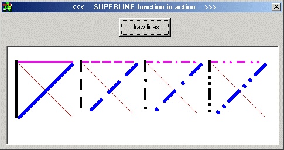

<div align="center">

## \_\_\_\_\_\_LINE super


</div>

### Description

SUPERLINE - Awesome! Draws even thick lines in dashes and dots!

SEE SCREENSHOT

Keywords: graphics, graph, shape, rectangle, ellipse, polyline, polygon, border, borderwidth,

solid, dash, dot, dashdot, dashdotdot, drawwidth, drawstyle, drawmode, gdi
 
### More Info
 
See Line method for Form or Picture.

SUPERLINE is just the same, BUT thick lines

can be drawn with dashes and dots (Line method can't).

no side effect possible, safest code


<span>             |<span>
---                |---
**Submitted On**   |
**By**             |[pietro ing\. cecchi](https://github.com/Planet-Source-Code/PSCIndex/blob/master/ByAuthor/pietro-ing-cecchi.md)
**Level**          |Advanced
**User Rating**    |5.0 (15 globes from 3 users)
**Compatibility**  |VB 6\.0
**Category**       |[Graphics](https://github.com/Planet-Source-Code/PSCIndex/blob/master/ByCategory/graphics__1-46.md)
**World**          |[Visual Basic](https://github.com/Planet-Source-Code/PSCIndex/blob/master/ByWorld/visual-basic.md)
**Archive File**   |[](https://github.com/Planet-Source-Code/pietro-ing-cecchi-line-super__1-38892/archive/master.zip)

### API Declarations

```
Private Declare Function MoveToEx Lib "gdi32" (ByVal hdc As Long, ByVal x As Long, ByVal y As Long, lpPoint As POINTAPI) As Long
Private Declare Function LineTo Lib "gdi32" (ByVal hdc As Long, ByVal x As Long, ByVal y As Long) As Long
Private Declare Function GetDC Lib "user32" (ByVal hwnd As Long) As Long
Private Declare Function ReleaseDC Lib "user32" (ByVal hwnd As Long, ByVal hdc As Long) As Long
Private Declare Function CreatePen Lib "gdi32" (ByVal nPenStyle As Long, ByVal nWidth As Long, ByVal crColor As Long) As Long
Private Declare Function SelectObject Lib "gdi32" (ByVal hdc As Long, ByVal hObject As Long) As Long
Private Declare Function DeleteObject Lib "gdi32" (ByVal hObject As Long) As Long
```


### Source Code

```
'++++++++++++++++++++++++++++++++++++++++++++++++++++++++++++++++++++++++
'+     +
'+ Published on Planet-Source-Code the 11th of september 2002 +
'+     +
'+ by Pietro Cecchi, pietrocecchi@inwind.it  +
'+     +
'+ SUPERLINE - Awesome! Draws even thick lines in dashes and dots! +
'+ Function DrawLine(ByVal isHwnd As Long,  +
'+  ByVal isX1 As Long, ByVal isY1 As Long, +
'+  ByVal isX2 As Long, ByVal isY2 As Long, +
'+  ByVal isColor As Long,  +
'+  ByVal isStyle As PenStyle,  +
'+  ByVal isWidth As Long)  +
'+ Enjoy!    +
'+     +
'++++++++++++++++++++++++++++++++++++++++++++++++++++++++++++++++++++++++
Option Explicit
Private Type POINTAPI
 x As Long
 y As Long
End Type
Private Declare Function MoveToEx Lib "gdi32" (ByVal hdc As Long, ByVal x As Long, ByVal y As Long, lpPoint As POINTAPI) As Long
Private Declare Function LineTo Lib "gdi32" (ByVal hdc As Long, ByVal x As Long, ByVal y As Long) As Long
Private Declare Function GetDC Lib "user32" (ByVal hwnd As Long) As Long
Private Declare Function ReleaseDC Lib "user32" (ByVal hwnd As Long, ByVal hdc As Long) As Long
Private Declare Function CreatePen Lib "gdi32" (ByVal nPenStyle As Long, ByVal nWidth As Long, ByVal crColor As Long) As Long
Private Declare Function SelectObject Lib "gdi32" (ByVal hdc As Long, ByVal hObject As Long) As Long
Private Declare Function DeleteObject Lib "gdi32" (ByVal hObject As Long) As Long
'Pen Styles
Public Enum PenStyle
 PS_SOLID = 0 'vbBSSolid-1
 PS_DASH = 1 'vbBSDash-1
 PS_DOT = 2 'vbBSDot-1
 PS_DASHDOT = 3 'vbBSDashDot-1
 PS_DASHDOTDOT = 4 'vbBSDashDotDot-1
End Enum
Public Function SUPERLINE(ByVal isHwnd As Long, ByVal isX1 As Long, ByVal isY1 As Long, ByVal isX2 As Long, ByVal isY2 As Long, ByVal isColor As Long, ByVal isStyle As PenStyle, ByVal isWidth As Long) As Integer
 Dim ishDC, hpen, hpenOLD, isPoint As POINTAPI
 Dim dashlen, dotlen, dashdotintervallen, linelen
 Dim a, segmentlen, segmenthowmany, segmentoflineX, intervallenonlineX, segmentoflineY, intervallenonlineY
 Dim isarc, istn, dashprojectionX, dashprojectionY
 Dim dotprojectionX, dotprojectionY
 Dim dashdotintervalprojectionX, dashdotintervalprojectionY
 Dim minlength As Integer
 Dim commandstring As String
 Dim movetoX, movetoY, movetoXsave, movetoYsave
  Dim isTMP As Single
  If isY1 > isY2 Then
    'shaffle end points
    isTMP = isX1
    isX1 = isX2
    isX2 = isTMP
    isTMP = isY1
    isY1 = isY2
    isY2 = isTMP
  End If
 'INPUT CONTROL
 Select Case isWidth
 Case 1 To 20
 Case Else
 isWidth = 1
 End Select
 ishDC = GetDC(isHwnd)
 hpen = CreatePen(PS_SOLID, isWidth, isColor) 'note: always solid
 hpenOLD = SelectObject(ishDC, hpen)
 dashlen = 4 * isWidth
 dotlen = 1 'note: dot len always 1
 dashdotintervallen = 2 * isWidth
 Select Case isStyle
 Case PS_SOLID
 MoveToEx ishDC, isX1, isY1, isPoint
 LineTo ishDC, isX2, isY2
 SUPERLINE = 1 'OK
 Case PS_DASH, PS_DOT, PS_DASHDOT, PS_DASHDOTDOT
 Select Case isStyle
 Case PS_DASH
 '- -
 minlength = 2 * dashlen + 1 * dashdotintervallen
 commandstring = "- "
 segmentlen = 1 * dashlen + 1 * dashdotintervallen
 Case PS_DOT
 '. .
 minlength = 2 * dotlen + 1 * dashdotintervallen
 commandstring = ". "
 segmentlen = 1 * dotlen + 1 * dashdotintervallen
 Case PS_DASHDOT
 '- . -
 minlength = 2 * dashlen + 1 * dotlen + 2 * dashdotintervallen
 commandstring = "- . "
 segmentlen = 1 * dashlen + 1 * dotlen + 2 * dashdotintervallen
 Case PS_DASHDOTDOT
 '- . . -
 minlength = 2 * dashlen + 2 * dotlen + 3 * dashdotintervallen
 commandstring = "- . . "
 segmentlen = 1 * dashlen + 2 * dotlen + 3 * dashdotintervallen
 End Select
 linelen = CInt(Sqr((isX2 - isX1) ^ 2 + (isY2 - isY1) ^ 2))
 Select Case linelen
 Case Is <= minlength 'shorter, draw solid line
 MoveToEx ishDC, isX1, isY1, isPoint
 LineTo ishDC, isX2, isY2
 SUPERLINE = 0 'line too short, dot and dashes can't be drawn
 Case Else 'longer, can draw dashed/dotted line
 SUPERLINE = 1 'OK
 segmenthowmany = linelen \ segmentlen
 segmentoflineX = (isX2 - isX1) \ segmenthowmany
 segmentoflineY = (isY2 - isY1) \ segmenthowmany
 If (isY2 - isY1) <> 0 Then 'avoid division by 0
  istn = (isX2 - isX1) / (isY2 - isY1)
  isarc = Atn(istn)
 Else 'pi/2
  isarc = Atn(1) * 2 * Sgn(isX2 - isX1)
 End If
 dashprojectionX = dashlen * Sin(isarc)
 dashprojectionY = dashlen * Cos(isarc)
 dotprojectionX = dotlen * Sin(isarc)
 dotprojectionY = dotlen * Cos(isarc)
 dashdotintervalprojectionX = dashdotintervallen * Sin(isarc)
 dashdotintervalprojectionY = dashdotintervallen * Cos(isarc)
 For a = 1 To segmenthowmany
  DoEvents
  Select Case isStyle
  Case PS_DASH
  movetoX = isX1 + segmentoflineX * (a - 1)
  movetoY = isY1 + segmentoflineY * (a - 1)
  MoveToEx ishDC, movetoX, movetoY, isPoint
  LineTo ishDC, movetoX + dashprojectionX, movetoY + dashprojectionY
  Case PS_DOT
  movetoX = isX1 + segmentoflineX * (a - 1)
  movetoY = isY1 + segmentoflineY * (a - 1)
  MoveToEx ishDC, movetoX, movetoY, isPoint
  LineTo ishDC, movetoX + dotprojectionX, movetoY + dotprojectionY
  Case PS_DASHDOT
  'dash
  movetoX = isX1 + segmentoflineX * (a - 1)
  movetoY = isY1 + segmentoflineY * (a - 1)
  MoveToEx ishDC, movetoX, movetoY, isPoint
  LineTo ishDC, movetoX + dashprojectionX, movetoY + dashprojectionY
  'move to middle of left space of segment
  movetoX = movetoX + dashprojectionX + (segmentoflineX - dashprojectionX) / 2
  movetoY = movetoY + dashprojectionY + (segmentoflineY - dashprojectionY) / 2
  MoveToEx ishDC, movetoX, movetoY, isPoint
  'dot is always 1 pixel
  dotprojectionX = 1
  dotprojectionY = 1
  'dot
  LineTo ishDC, movetoX + dotprojectionX, movetoY + dotprojectionY
  Case PS_DASHDOTDOT
  'dash
  movetoX = isX1 + segmentoflineX * (a - 1)
  movetoY = isY1 + segmentoflineY * (a - 1)
  MoveToEx ishDC, movetoX, movetoY, isPoint
  LineTo ishDC, movetoX + dashprojectionX, movetoY + dashprojectionY
  movetoXsave = movetoX
  movetoYsave = movetoY
  'move to 1/3 of left space of segment
  movetoX = movetoX + dashprojectionX + (segmentoflineX - dashprojectionX) / 3
  movetoY = movetoY + dashprojectionY + (segmentoflineY - dashprojectionY) / 3
  MoveToEx ishDC, movetoX, movetoY, isPoint
  'dot is always 1 pixel
  dotprojectionX = 1
  dotprojectionY = 1
  'dot
  LineTo ishDC, movetoX + dotprojectionX, movetoY + dotprojectionY
  'move to 2/3 of left space of segment
  movetoX = movetoXsave + dashprojectionX + (segmentoflineX - dashprojectionX) / 3 * 2
  movetoY = movetoYsave + dashprojectionY + (segmentoflineY - dashprojectionY) / 3 * 2
  MoveToEx ishDC, movetoX, movetoY, isPoint
  'dot
  LineTo ishDC, movetoX + dotprojectionX, movetoY + dotprojectionY
  End Select
 Next
 End Select
 End Select
 SelectObject ishDC, hpenOLD
 DeleteObject hpen
 ReleaseDC isHwnd, ishDC
End Function
```

